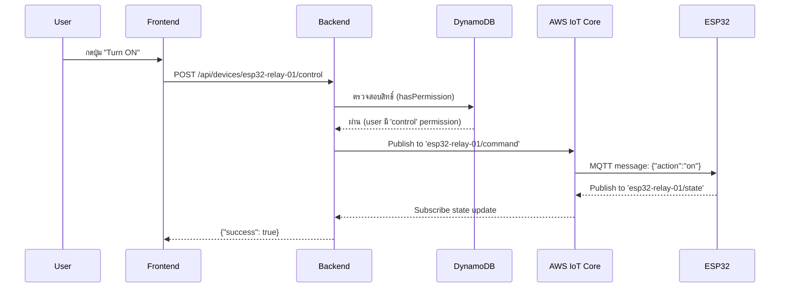
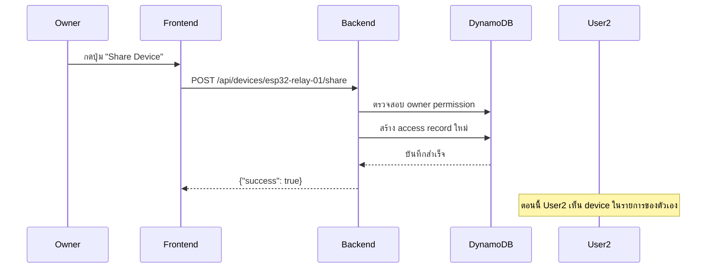
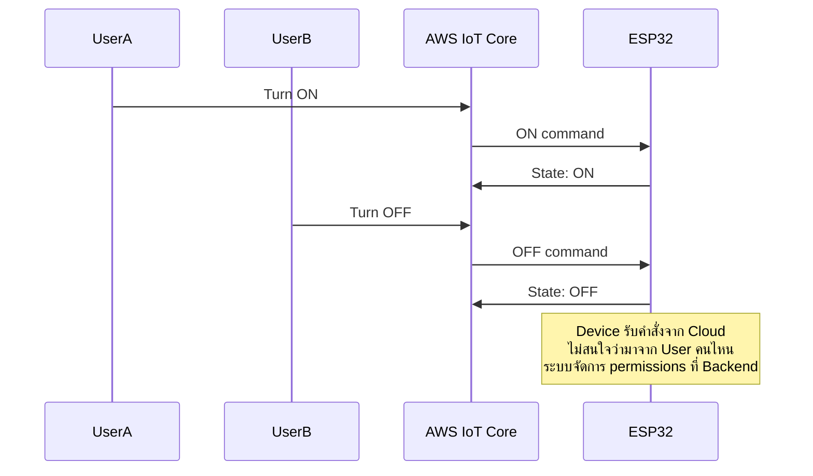

# Multi-User IoT Device Control System

## สถาปัตยกรรมระบบ

```
┌──────────────┐      ┌──────────────┐      ┌──────────────┐
│   User A     │      │   User B     │      │   User C     │
│  (Wi-Fi A)   │      │  (Wi-Fi B)   │      │  (Wi-Fi C)   │
└──────┬───────┘      └──────┬───────┘      └──────┬───────┘
       │                      │                     │
       └─────────────┬────────┴──────────┬──────────┘
                     │                   │
              ┌──────▼──────┐    ┌──────▼──────┐
              │  Web App    │    │   Backend   │
              │ (Next.js)   │    │  (Node.js)  │
              └─────────────┘    └──────┬───────┘
                                        │
                                 ┌──────▼──────────┐
                                 │  AWS IoT Core   │
                                 │    (MQTT)       │
                                 └─────┬─┬─┬───────┘
                                       │ │ │
                      ┌────────────────┘ │ └────────────────┐
                      │                  │                  │
               ┌──────▼──────┐    ┌─────▼──────┐   ┌──────▼──────┐
               │  ESP32-1    │    │  ESP32-2   │   │  ESP32-3    │
               │ (Wi-Fi X)   │    │ (Wi-Fi Y)  │   │ (Wi-Fi Z)   │
               └─────────────┘    └────────────┘   └─────────────┘
```

## คุณสมบัติหลัก

### 1. **Multi-User Access Control**
- แต่ละ user มี account แยก (login ต่างกัน)
- กำหนดสิทธิ์การเข้าถึง device ได้ 4 ระดับ:
  - **Owner**: ควบคุมเต็มรูปแบบ + แชร์ + ลบ device
  - **Admin**: ควบคุม + แชร์ device
  - **User**: ควบคุม + อ่านข้อมูล
  - **Viewer**: อ่านข้อมูลอย่างเดียว

### 2. **Cloud-Based Control via AWS IoT Core**
- ผู้ใช้และ device ไม่จำเป็นต้องอยู่ Wi-Fi เดียวกัน
- ควบคุมผ่าน MQTT over TLS
- Real-time communication
- Device shadow สำหรับ state sync

### 3. **Device Sharing**
- Owner สามารถแชร์ device ให้ผู้อื่นได้
- กำหนด role และ permissions ของแต่ละคน
- เพิกถอนสิทธิ์ได้ทันที

### 4. **Cross-Network Operation**
- User A (บ้าน) ควบคุม device → Cloud → Device (ออฟฟิศ)
- User B (ต่างประเทศ) ควบคุมได้พร้อมกัน
- ไม่จำกัดระยะทาง เพราะผ่าน Internet

## การติดตั้งและใช้งาน

### 1. Setup DynamoDB Tables

```powershell
# Backend
cd backend
npx tsx scripts/setup-device-access.ts
npx tsx scripts/insert-sample-access.ts
```

### 2. ตั้งค่า Environment Variables

**backend/.env**:
```env
AWS_REGION=ap-southeast-1
AWS_IOT_ENDPOINT=xxxxx-ats.iot.ap-southeast-1.amazonaws.com
AWS_ACCESS_KEY_ID=your-access-key
AWS_SECRET_ACCESS_KEY=your-secret-key
DYNAMODB_DEVICE_ACCESS_TABLE=DeviceAccess
```

**frontend/.env.local**:
```env
NEXT_PUBLIC_AWS_REGION=ap-southeast-1
NEXT_PUBLIC_AWS_IOT_ENDPOINT=xxxxx-ats.iot.ap-southeast-1.amazonaws.com
```

### 3. รัน Application

```powershell
# Terminal 1 - Backend
cd backend
npm run dev

# Terminal 2 - Frontend
cd frontend
npm run dev
```

### 4. เตรียม ESP32 Device

**ฮาร์ดแวร์ต้องมี**:
1. Certificate (device-certificate.pem.crt)
2. Private Key (device-private.pem.key)
3. Root CA (AmazonRootCA1.pem)
4. IoT endpoint configuration

**ตัวอย่าง Code**:
```cpp
const char* MQTT_BROKER = "xxxxx-ats.iot.ap-southeast-1.amazonaws.com";
const int MQTT_PORT = 8883;
const char* CLIENT_ID = "esp32-relay-01";
const char* TOPIC_COMMAND = "esp32-relay-01/command";
const char* TOPIC_STATE = "esp32-relay-01/state";

void callback(char* topic, byte* payload, unsigned int length) {
  // รับคำสั่งจาก Cloud
  String message = String((char*)payload).substring(0, length);
  
  if (message.indexOf("\"action\":\"on\"") > 0) {
    digitalWrite(LED_PIN, HIGH);
    publishState("on");
  }
  else if (message.indexOf("\"action\":\"off\"") > 0) {
    digitalWrite(LED_PIN, LOW);
    publishState("off");
  }
}
```

## API Endpoints

### Device Management

#### GET `/api/user/devices`
ดึงรายการ devices ที่ user มีสิทธิ์เข้าถึง

**Response**:
```json
{
  "success": true,
  "data": [
    {
      "deviceId": "esp32-relay-01",
      "deviceName": "Living Room Light",
      "thingName": "esp32-relay-01",
      "deviceType": "relay",
      "status": "online",
      "role": "owner",
      "permissions": ["read", "write", "control", "share", "delete"],
      "isOwner": true
    }
  ],
  "count": 1
}
```

#### POST `/api/devices/:deviceId/control`
ส่งคำสั่งควบคุม device

**Request**:
```json
{
  "action": "on",
  "value": 100
}
```

**Response**:
```json
{
  "success": true,
  "message": "Command sent to esp32-relay-01",
  "data": {
    "deviceId": "esp32-relay-01",
    "action": "on",
    "value": 100
  }
}
```

#### POST `/api/devices/:deviceId/share`
แชร์ device ให้ user อื่น

**Request**:
```json
{
  "targetUserId": "user2",
  "role": "user"
}
```

#### GET `/api/devices/:deviceId/users`
ดูรายชื่อผู้ที่มีสิทธิ์เข้าถึง device

#### DELETE `/api/devices/:deviceId/users/:targetUserId`
เพิกถอนสิทธิ์ user

## การทำงานของระบบ

### 1. User ควบคุม Device



### 2. Owner แชร์ Device



### 3. Multi-User Control



## Security Features

1. **JWT Authentication**: ทุก API ต้อง authenticate
2. **Permission-Based Access Control**: ตรวจสอบสิทธิ์ทุกครั้ง
3. **TLS/SSL**: MQTT ใช้ port 8883 (encrypted)
4. **Device Certificates**: ESP32 ใช้ client certificates
5. **IAM Policies**: AWS จำกัดสิทธิ์ตาม role

## ข้อดีของระบบนี้

✅ **ไม่จำกัด Wi-Fi**: ผู้ใช้และ device อยู่ network ไหนก็ได้  
✅ **Multi-User**: หลายคนควบคุม device เดียวกันได้พร้อมกัน  
✅ **Permission Control**: กำหนดสิทธิ์ละเอียด (read/write/control/share)  
✅ **Real-Time**: MQTT มี latency ต่ำ  
✅ **Scalable**: รองรับ device หลายพันตัว  
✅ **Reliable**: AWS IoT Core มี 99.9% uptime  

## การทดสอบ

### Scenario 1: User ต่าง Wi-Fi ควบคุม Device

1. User A login ที่บ้าน (Wi-Fi: Home)
2. User B login ที่ออฟฟิศ (Wi-Fi: Office)
3. Device อยู่ที่โรงงาน (Wi-Fi: Factory)
4. ทั้ง A และ B ควบคุม device พร้อมกัน ผ่าน Cloud

### Scenario 2: แชร์ Device ระหว่าง User

1. User1 ลงทะเบียน device → เป็น owner
2. User1 แชร์ให้ User2 role="user"
3. User2 เห็น device ใน dashboard
4. User2 ควบคุมได้ แต่แชร์ต่อไม่ได้ (ไม่มี 'share' permission)

## สรุป

ระบบนี้แก้ปัญหา:
- ✅ User หลายคนใช้ Wi-Fi ต่างกัน
- ✅ Device อยู่ Wi-Fi ใดก็ได้
- ✅ ควบคุมผ่าน Internet ได้ทุกที่
- ✅ จัดการสิทธิ์แบบ role-based
- ✅ Real-time control via MQTT

**สถาปัตยกรรมหลัก**: Web App → Backend API → AWS IoT Core (MQTT) → ESP32 Devices
